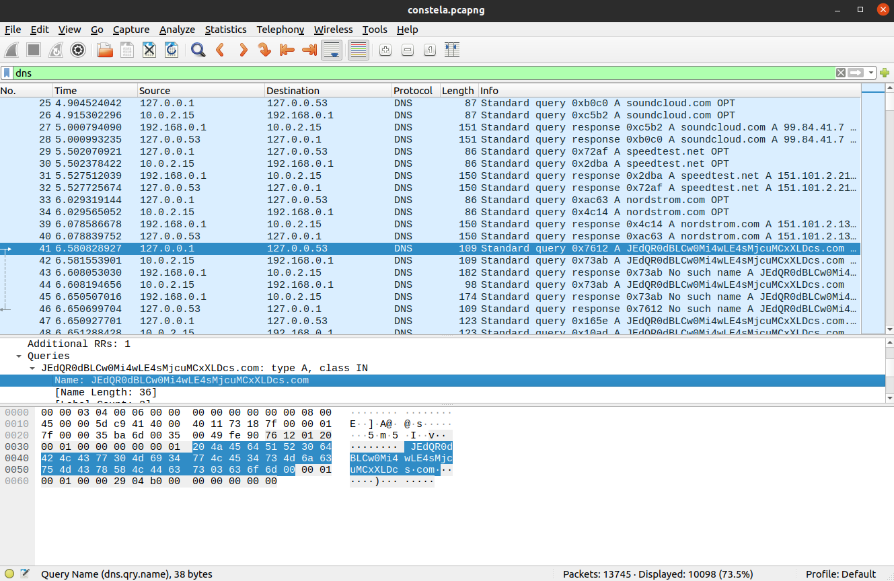

# **CSAW '21 FINALS**
## **Constela (Forensics, 287 points)**
### **Challenge description:**

>The year is 7331, and BadCorp rules the galaxy with its >omnipresent satellites.   
But recently a resistance movement led by a band of hackers calling themselves the OSIRIS has hacked into BadCorp systems!   
They have taken over the satellites and it is believed they are trying to send a message across the galaxy...can humanity see their message?

### **Traffic Analysis**

They provide a *.pcap* ([constela.pcapng](constela/constela.pcapng)), in which we can find a lot of diffrent traffic. After inspectioning a little the conversations, I found a TCP stream with an intersting repeated **hexadecimal string**.

>0x42416837436b6b694657567559574a735a5639755a58647a58325a6c5a5751474f675a465646524a49694268645852766257463061574e68624778350a58324e6f5a574e72583356775a4746305a584d474f77425556456b694848567a5957646c5832316c64484a7059334e6664584e6c636c396b595852680a426a73415646524a49686431634752686447566663484a7665486c665a584a79623349474f7742554d456b69465856775a4746305a563968646d46700a62474669624755474f7742554d413d3d0aC

That resulted in a **base64** message, decoded with the usual pipe of `echo "base64_message" | base64 -d` :

>BAh7CkkiFWVuYWJsZV9uZXdzX2ZlZWQGOgZFVFRJIiBhdXRvbWF0aWNhbGx5X2NoZWNrX3VwZGF0ZXMGOwBUVEkiHHVzYWdlX21ldHJpY3NfdXNlcl9kYXRhBjsAVFRJIhd1cGRhdGVfcHJveHlfZXJyb3IGOwBUMEkiFXVwZGF0ZV9hdmFpbGFibGUGOwBUMA==
>
>I"enable_news_feed:ETTI" automatically_check_updates;TTI"usage_metrics_user_data;TTI"update_proxy_error;T0I"update_available;T0

**Unfortunatly, this led to nowhere :(**.

So I returned to the *.pcap* in order to find something else. In the **DNS messages** I noticed something strange. In a lot of traces with requests to a  variety of sites, I ***c***saw (xD) some odd sites that appears one following the other, for example:

> JEdQR0dBLCwzMC4wLE4sMzUuMCxXLDcs.com  
MDAsLDEwMDIwLjAsZnQsLCwsKjQ3.com




Then, as before, I decoded it from base64 taking the concatenation of the two strings excpet the *.com*.

>$GPGGA,,42.0,N,27.0,W,7,00,,10015.0,ft,,,,*47

This is a message format used for the **GPS satellite location** (*as hinted by the challenge description*) with fields as follows:

>$GPGGA,123519,4807.038,N,01131.000,E,1,08,0.9,545.4,M,46.9,M,,*47
>
>Where:
>```
>     GGA          Global Positioning System Fix Data
>     123519       Fix taken at 12:35:19 UTC
>     4807.038,N   Latitude 48 deg 07.038' N
>     01131.000,E  Longitude 11 deg 31.000' E
>     1            Fix quality: 0 = invalid
>                               1 = GPS fix (SPS)
>                               2 = DGPS fix
>                               3 = PPS fix
>			                  4 = Real Time Kinematic
>			                  5 = Float RTK
>                               6 = estimated (dead reckoning) (2.3 feature)
>			                  7 = Manual input mode
>			                  8 = Simulation mode
>     08           Number of satellites being tracked
>     0.9          Horizontal dilution of position
>     545.4,M      Altitude, Meters, above mean sea level
>     46.9,M       Height of geoid (mean sea level) above WGS84
>                      ellipsoid
>     (empty field) time in seconds since last DGPS update
>     (empty field) DGPS station ID number
>     *47          the checksum data, always begins with *```

I tried to put the coordinates in google maps but they are placed in the Atlantic Ocean with nothing to see.

After that I noticed that in the DNS streams all the times the two strings that can be concatenated appear, they have a slightly difference in the characters, meaning that there are more coordinates.

I collected all of them using a wireshark filter:

> `dns && (((ip.src == 127.0.0.1) && (ip.dst == 127.0.0.53))) && ((frame.len==109) || (frame.len==105)) && dns.qry.name `

that takes all the frames that are coupled one after the other, without repeatin them with the dns request forwarding. Wireshark gives the possibility to export the result in a json file, in order to use it in a python exploit ([export](constela/values.json)).

## **Exploit**

In the exploit I took the values (**321 locations**) of longitude, latitude and altitude in order to plot them, and after a lot of different tries (even a 3D plot with all the elements, quite beautiful).Finally I maneged to get the right combiantion: **Latitude and Altitude**, both with a max range of 25 different elements.


## The result is a square, that if shrunk a bit gives a **QR CODE** that returns the flag!


> `flag{tH3_5chw1fTy_C0n3teLat10N}`

The exploit can be found at [exploit.py](constela/exploit.py)


<br />
<br />
<br />
<br />

## GG to the author (not specified in the description, so thanks CSAW team), very funny chall!  
<br />

## See ya, biaso.